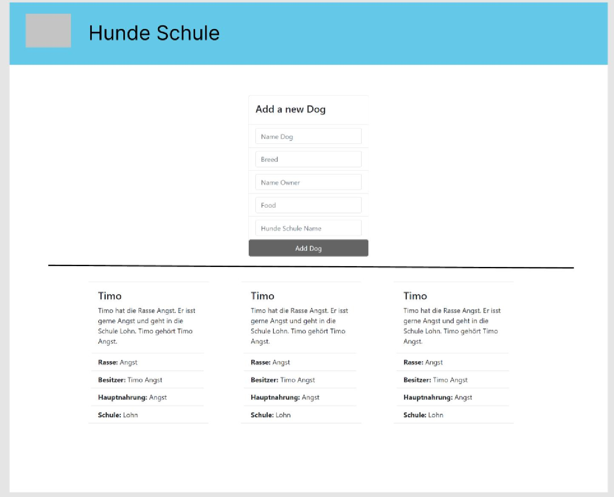

= Hundeschule

In unserer API geht es um eine Hundeschule. Man kann dort seinen Hund zu einer beliebigen Hundeschule hinzufügen.
Man kann auch die Owner der Hunde verwalten. Zu der Nahrung gibt es auch noch ein extra Objekt um genauere Infos über das Essen zu bekommen.

:doctype: article
.Usecasediagram von der Hundeschule
[plantuml]
----
@startuml
left to right direction
rectangle HundeSchule {
    usecase "ownerwechsel" as UC1
}
Hund --> UC1 : UC1
@enduml
----
== UC-1 Owner wechsel
Ich will den primären Besitzer eines Hundes wechseln

[plantuml]
----
@startuml
actor user
user -> backend : GET /api/dogs
user <- backend : 200 List<DogDTO>
note left: ahh now I\n know the dog id
@enduml
----
== Klassendiagramm
[plantuml]
----
@startuml
class Herrchen {
+ name
+ dog: Hund
+ age
}
class Hund {
+ name
+ breed
+ owner
+ food
+ age
setOwner()
}
class Hundeschule {
+ location
}
Hund::owner -> Herrchen::dog
Hund::dogSchool -> Hundeschule::location
@enduml
----
Diese Api ist basiert auf einer Hundeschule. Man kann seinen Hund hinzugfügen
mit seinem Owner aber den auch ändern.

== Wireframe

Man sieht auf dem Wireframe das man oben einen neuen Hund hinzugfügen kann.
Dafür werden verschiedene Input-Felder bereitgestellt um das Objekt abzufüllen.
Daneben kommt noch eine Card damit man den Owner des Hundes wechseln kann.
Unter dem befinden sich die momentanen hinzugefügten Hunde auf Cards mit ihren Daten.

== 4. Fazit
Wir finden dass uns eine gute API gelungen ist. Wir hätten die einen Sachen schon von Anfang an richtig machen können den wir hatten gegen den Schluss viele Probleme. Trotzdem haben wir gute Objekte erstellt und gut zusammengehängt.